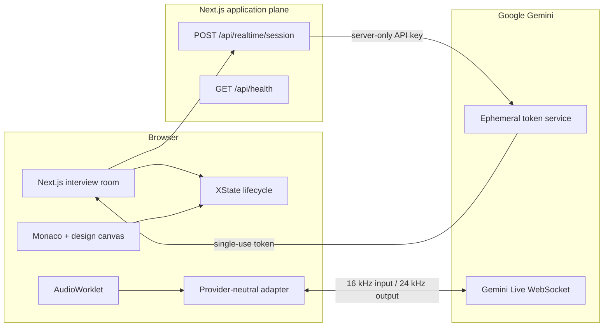
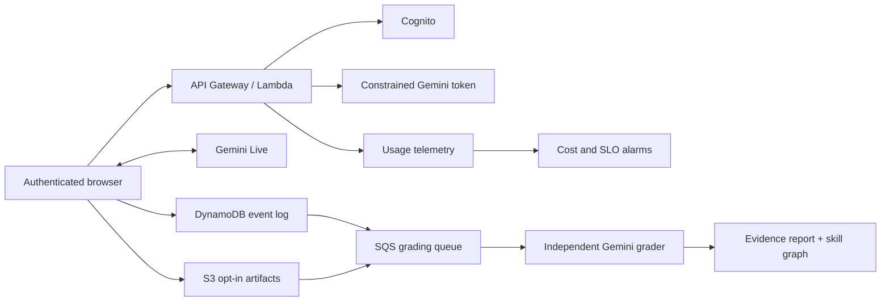

# Signal Room — AI Technical Interview Coach

[](https://github.com/AloysiusLimMingZhou/signal-room-interview-coach/actions/workflows/ci.yml)

Signal Room is a Gemini-first web prototype for practicing system-design, ML-design, and algorithm interviews. It treats the transcript, code, and architecture diagram as first-class evidence, then creates a coaching scorecard that links back to those artifacts.

The app is fully usable in deterministic mock mode. No API key, model spend, microphone access, database, or AWS account is required to develop and test it.

## Source of truth

[`architecture.md`](./architecture.md) is authoritative for product scope, provider boundaries, contracts, privacy rules, testing, and delivery. Architecture-impacting changes must update it in the same pull request.

## P0 experience

- Choose system design, ML system design, or algorithms with a difficulty calibration.
- Run a text-driven mock interview using the same provider-neutral boundary as Gemini Live.
- Work in a lazy-loaded Monaco editor or structured architecture canvas.
- Inject a realistic mid-interview constraint.
- See a live Gemini cost estimate.
- Finish with an evidence-linked scorecard.
- Provision constrained Gemini Live ephemeral credentials without exposing the standard key.

## P0 architecture



Without `GEMINI_API_KEY`, the session endpoint returns a local mock descriptor and the browser never contacts Google.

## Run locally

Requirements: Node.js 22+ and pnpm 11.19+.

```bash
pnpm install
pnpm dev
```

Open `http://localhost:3000`. With no `.env.local`, the UI automatically uses mock mode.

For a production-style local check:

```bash
pnpm build
pnpm start
```

Open `http://localhost:3000/api/health` and confirm the response contains `"status":"ok"` before entering the interview room.

## Enable Gemini Live

Copy `.env.example` to `.env.local` and add the key when it is available:

```dotenv
GEMINI_API_KEY=your_server_only_key
GEMINI_LIVE_MODEL=gemini-3.1-flash-live-preview
```

`GEMINI_API_KEY` is read only by `POST /api/realtime/session`. The browser receives a short-lived, single-use token constrained to the selected Live model and audio modality. Never rename it to a `NEXT_PUBLIC_*` variable.

The browser adapter includes 16 kHz PCM microphone capture, 24 kHz PCM playback, transcription handling, and interruption. Robust reconnect UX remains post-P0 work; the architecture already reserves session resumption and context compression.

> **Live-preview safety:** do not place `GEMINI_API_KEY` in a public P0 deployment. The token-provisioning route has no production authentication or per-user quota yet. Run the public demo in mock mode, or enable Gemini only behind an access-controlled preview.

## Test and build

```bash
pnpm lint
pnpm typecheck
pnpm audit:prod
pnpm test:ci
pnpm build
pnpm exec playwright install chromium
pnpm test:e2e
```

Jest verifies cost math, the interview state machine, evidence generation, and the no-key/API-key-leak session boundary. Playwright completes the candidate journey in mock mode and never calls Gemini.

## CI/CD

`.github/workflows/ci.yml` runs lint, type checking, Jest coverage, a production build, and Chromium Playwright tests for pull requests and `main`.

`.github/workflows/deploy-amplify.yml` starts an AWS Amplify release only after a successful `main` CI run or an approved manual dispatch. Configure:

- Variable `AWS_REGION` (`ap-southeast-1` by default).
- Variable `AMPLIFY_APP_ID`.
- Variable `AMPLIFY_BRANCH` (normally `main`).
- Production environment secret `AWS_DEPLOY_ROLE_ARN` for a least-privilege GitHub OIDC role.
- `GEMINI_API_KEY` and `GEMINI_LIVE_MODEL` in Amplify server-side environment configuration when enabling Live mode.

No long-lived AWS access key is stored in GitHub.

## Launch the P0 prototype

### Option A — fastest public demo

1. Open AWS Amplify Hosting and choose **New app → GitHub**.
2. Select `AloysiusLimMingZhou/signal-room-interview-coach` and branch `main`.
3. Let Amplify use the committed `amplify.yml` build specification.
4. Do **not** configure `GEMINI_API_KEY`; this keeps the public demo in deterministic mock mode with no model spend.
5. Deploy, open the generated Amplify URL, and verify `/api/health` before running one complete interview.

### Option B — access-controlled Gemini preview

1. Protect the preview with authenticated access before enabling paid model usage.
2. Add `GEMINI_API_KEY` and optionally `GEMINI_LIVE_MODEL` as server-side Amplify environment variables.
3. Confirm that neither value uses a `NEXT_PUBLIC_` prefix.
4. Add a billing budget and API usage alert in the Google project.
5. Test microphone permission, interruption, a ten-minute reconnect boundary, and quota exhaustion with a non-production key.

### Enable the GitHub deployment workflow

After the Amplify app exists, configure the repository:

- Variable `AWS_REGION=ap-southeast-1`.
- Variable `AMPLIFY_APP_ID=<your Amplify app id>`.
- Variable `AMPLIFY_BRANCH=main`.
- Production environment secret `AWS_DEPLOY_ROLE_ARN=<least-privilege OIDC role ARN>`.

The deployment workflow then waits for CI on `main`, authenticates to AWS using OIDC, starts the Amplify release, and waits for its result.

## Next-step features

Recommended order after the mock P0 is publicly reachable:

1. **Protected Gemini pilot:** Cognito sign-in, token-provisioning authorization, per-user quotas, rate limiting, and spend cutoffs.
2. **Reliable 45-minute sessions:** persist resumption handles, react to `GoAway`, recover microphone/device changes, and retain a compact context summary.
3. **Artifact-aware interviewing:** emit structured code patches and canvas node/edge events to Gemini so follow-up questions reference actual work.
4. **Independent evidence grading:** asynchronously grade the frozen transcript, code, and canvas snapshot with a separate Gemini text-model call and versioned rubric.
5. **Rewind and retry:** branch from a question, replay the scenario, and compare evidence between both attempts.
6. **Skill history:** Cognito identity, DynamoDB event/report storage, longitudinal competency graph, and recommended next interview.
7. **Production observability:** OpenTelemetry traces, Sentry, provider usage ingestion, cost per completed interview, reconnect SLOs, and daily-spend alarms.

Target P1 shape:



## Current Gemini pricing assumption

Official paid-tier prices checked on 2026-09-01 for `gemini-3.1-flash-live-preview` are approximately $0.005/minute of audio input and $0.018/minute of audio output. Thirty candidate minutes plus ten interviewer minutes is a $0.33 duration-only lower bound. Re-billed conversational context makes the working 45-minute planning range $1.50–$1.80 until production usage telemetry replaces the estimate.

Pricing and protocol references are maintained in [`architecture.md`](./architecture.md). Verify them again before launch because the model and Live API are preview services.
