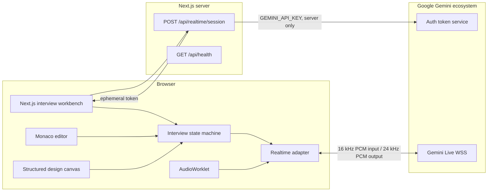

# Architecture: AI Technical Interview Coach

**Status:** Source of truth

**Last updated:** 2026-09-01

**Owner:** Project engineering
**Target:** Candidate-practice P0, web only

## 1. Authority and change policy

This file defines the accepted product scope, runtime boundaries, provider integration, contracts, security rules, tests, and delivery model. When code and this document disagree, this document wins until both are changed together.

Architecture changes require all of the following in one pull request:

- Update this document and its decision log.
- Update affected runtime schemas and tests.
- State migration or compatibility impact.
- Preserve a working mock path when an external provider is unavailable.

## 2. Product boundary

P0 is a candidate-facing interview-practice web application. It demonstrates the complete local experience without requiring cloud credentials:

- Choose an interview track and difficulty.
- Start a timed mock interview.
- Read and answer interviewer prompts.
- Edit code in Monaco.
- Build a small structured system diagram.
- Inject a changing requirement.
- Finish and view an evidence-oriented report.
- Review a live cost estimate.

P0 does not include employer screening, hiring recommendations, webcam analysis, covert proctoring, payments, persistence across devices, server-side arbitrary code execution, or production authentication.

## 3. Architectural principles

1. **Gemini-first:** Gemini Live is the only external realtime provider in P0.
2. **Offline-capable:** no API key is required for local development, CI, Jest, or Playwright.
3. **Direct media:** production browser audio connects directly to Gemini using a constrained ephemeral token.
4. **Server-held secret:** `GEMINI_API_KEY` is read only in the session-provisioning route.
5. **Provider boundary:** UI state depends on a provider-neutral adapter, not Gemini event shapes.
6. **Evidence over opaque scores:** reports cite transcript and artifact events.
7. **Append-only events:** interview actions are sequenced and idempotent.
8. **No unsafe execution:** P0 code execution is represented by a deterministic browser-safe simulation; real sandboxing is a later boundary.
9. **Measured cost:** price estimates are visible and actual provider usage will supersede them.

## 4. Runtime topology



When `GEMINI_API_KEY` is absent, the session route returns a mock session descriptor and no Google endpoint is called.

## 5. Technology decisions

| Area | Decision | P0 note |
|---|---|---|
| Framework | Next.js App Router, React, TypeScript | Server page with focused client islands |
| State | XState | Explicit setup, connecting, active, grading, completed states |
| Code editor | Monaco | Dynamically imported with SSR disabled |
| Canvas | Structured React canvas | Excalidraw remains the post-P0 target; P0 proves artifact events with a lighter surface |
| Styling | Project-owned CSS | Tailwind/shadcn adoption is deferred until component patterns stabilize |
| Runtime validation | Zod | API request and response boundaries |
| Unit/component tests | Jest and Testing Library | No external provider calls |
| Browser tests | Playwright | Mock mode only in CI |
| CI | GitHub Actions | lint, types, Jest, build, Playwright |
| CD | GitHub Actions to AWS Amplify | OIDC plus repository/environment configuration |

Intentional P0 deviations from the longer-term blueprint are documented in this table. They are not silent implementation drift.

## 6. Gemini Live integration

### 6.1 Model and protocol

- Default model: `gemini-3.1-flash-live-preview`.
- Transport: stateful WebSocket.
- Input: raw 16-bit little-endian PCM at 16 kHz.
- Output: raw 16-bit little-endian PCM at 24 kHz.
- Browser input chunks: 20–40 ms target.
- Production authentication: constrained ephemeral token.
- Session configuration: audio response, input/output transcription, session resumption, and context compression.

The model and the Live API are preview services. Model ID changes must be configuration changes with a smoke-test canary, not UI edits.

### 6.2 Credential boundary

`POST /api/realtime/session` is the only P0 path that reads `GEMINI_API_KEY`.

The route:

1. Validates the request.
2. Returns mock configuration when the key is absent.
3. Calls Google's auth-token service when the key is present.
4. Constrains the token to the configured Live model and audio modality.
5. Locks a track/difficulty-specific interviewer instruction into the token configuration.
6. Limits new-session initiation to one minute and token lifetime to 60 minutes so a 45-minute interview can reconnect.
7. Returns only the short-lived token, model, expiry, and WebSocket URL.
8. Uses `Cache-Control: no-store`.

The standard API key must never be returned, serialized into props, prefixed with `NEXT_PUBLIC_`, or included in error output.

### 6.3 Long sessions

A 45-minute interview must enable:

- Context compression with a 25,000-token trigger and an 8,000-token sliding window.
- Session resumption using the latest server-issued handle.
- Proactive reconnect handling when Gemini sends `GoAway`.
- A compact local context summary if a session cannot resume.

Without compression, Google documents a 15-minute audio-only session limit. Individual WebSocket connections can also be periodically reset.

### 6.4 Pricing baseline

Pricing was verified from Google's official pricing page on 2026-09-01.

For `gemini-3.1-flash-live-preview` paid tier:

- Text input: $0.75 per 1M tokens.
- Audio input: $3.00 per 1M tokens, approximately $0.005 per minute.
- Image/video input: $1.00 per 1M tokens, approximately $0.002 per minute.
- Text output: $4.50 per 1M tokens.
- Audio output: $12.00 per 1M tokens, approximately $0.018 per minute.

The free tier lists input and output as free, but free-tier content may be used to improve Google's products. Paid-tier content is listed as not used to improve products.

Duration-only example for a 45-minute session with 30 minutes candidate audio and 10 minutes interviewer audio:

```text
30 × $0.005 + 10 × $0.018 = $0.33
```

This is a lower bound. Gemini Live rebills accumulated context each turn. With the documented P0 compression assumptions, the planning budget remains **$1.50–$1.80 per completed interview** until measured usage replaces the estimate.

References:

- https://ai.google.dev/gemini-api/docs/live-api
- https://ai.google.dev/gemini-api/docs/pricing
- https://ai.google.dev/gemini-api/docs/live-api/ephemeral-tokens
- https://ai.google.dev/gemini-api/docs/live-api/session-management
- https://ai.google.dev/gemini-api/docs/live-api/best-practices

## 7. Provider-neutral contracts

```ts
type RealtimeMode = "mock" | "gemini";

interface RealtimeAdapter {
  connect(session: RealtimeSession): Promise<void>;
  sendText(text: string): void;
  startMicrophone(): Promise<void>;
  stopMicrophone(): Promise<void>;
  interrupt(): void;
  close(): Promise<void>;
  subscribe(listener: (event: RealtimeEvent) => void): () => void;
}
```

Persistable events use a provider-independent envelope:

```ts
interface InterviewEvent<T = unknown> {
  id: string;
  sessionId: string;
  sequence: number;
  occurredAt: string;
  type: InterviewEventType;
  payload: T;
}
```

Gemini-native payloads may appear only in redacted diagnostics and are not domain contracts.

## 8. Interview state machine

```text
setup
  -> connecting
  -> active.listening <-> active.responding
  -> grading
  -> completed

connecting | active -> failed
failed -> setup
```

Invariants:

- One active interviewer audio source.
- One logical interview session across reconnects.
- Functional, append-only transcript and artifact updates.
- Provider failure never destroys local workbench state.
- Completing the interview freezes the evidence snapshot used by the report.

## 9. P0 data ownership

P0 keeps interview state in browser memory and does not persist personal data. Reloading resets the session. The API route emits no transcript or artifact logs.

Future AWS persistence boundaries remain:

- DynamoDB for manifests, events, reports, and skill observations.
- S3 for opt-in audio and large artifacts.
- SQS and Lambda for independent grading.
- Cognito for authentication.

Those services are not simulated as if they already exist.

## 10. Security and privacy constraints

- No secret in client bundles or `NEXT_PUBLIC_*` variables.
- No audio recording or upload in P0.
- Microphone starts only after a direct user action.
- Mock mode never requests microphone permission.
- API errors return safe categories, not upstream bodies or credentials.
- CSP and production WAF rules are deployment concerns documented before launch.
- User-supplied code is never evaluated in the main browser context or on the server.
- Analytics must not receive transcript, resume, code, canvas, credential, or raw audio content.
- A public P0 deployment must run without `GEMINI_API_KEY`. The live key is allowed only in an access-controlled preview until authentication, per-user quotas, and rate limiting protect token provisioning.

## 11. Testing contract

### Jest

- Cost estimator uses the published Gemini rates.
- Interview state and evidence report are deterministic.
- Session route returns mock mode without a key.
- Session route does not expose the standard API key when provisioning succeeds or fails.

### Playwright

- Home page renders and identifies mock mode.
- Candidate starts an interview.
- Candidate submits an answer and receives a follow-up.
- Code and canvas workbench tabs operate.
- Scenario injection appears in the transcript.
- Candidate ends the interview and sees the evidence report.

No automated test may depend on a real Gemini credential or incur model cost.

## 12. CI/CD contract

`ci.yml` runs on pull requests and pushes:

1. Frozen dependency install.
2. Production dependency audit, failing on moderate-or-higher advisories.
3. Lint.
4. Typecheck.
5. Jest with coverage.
6. Production build.
7. Playwright Chromium smoke test.
8. Test artifact upload on failure.

`deploy-amplify.yml` starts an Amplify release only after CI succeeds on `main` or by approved manual dispatch. It uses GitHub OIDC and requires:

- Repository variable `AWS_REGION` (default architecture value: `ap-southeast-1`).
- Repository variable `AMPLIFY_APP_ID`.
- Repository variable `AMPLIFY_BRANCH`.
- Environment secret `AWS_DEPLOY_ROLE_ARN`.

The workflow does not store AWS access keys.

## 13. Acceptance criteria

- `pnpm lint`, `pnpm typecheck`, `pnpm test:ci`, and `pnpm build` pass.
- Playwright completes the P0 candidate flow in Chromium.
- App works without `GEMINI_API_KEY` and clearly labels mock mode.
- A missing key never blocks CI or local UI work.
- API-key text is absent from generated client assets.
- Architecture and implementation agree on model, prices, contracts, and P0 boundaries.

## 14. Decision log

| Date | Decision | Rationale |
|---|---|---|
| 2026-09-01 | Use Gemini ecosystem only in P0 | Lower realtime price and user preference |
| 2026-09-01 | Support mock mode as a first-class adapter | Development and CI must not require credentials or incur cost |
| 2026-09-01 | Use ephemeral browser credentials | Lowest media latency while keeping the standard key server-side |
| 2026-09-01 | Use a lightweight structured canvas in P0 | Proves artifact-aware events without taking on Excalidraw bundle complexity yet |
| 2026-09-01 | Keep P0 state in memory | Avoid pretending production AWS persistence exists before infrastructure work |
| 2026-09-01 | Use a 60-minute ephemeral-token lifetime with a one-minute start window | Supports a 45-minute interview and planned reconnects while limiting token exposure |
| 2026-09-01 | Gate CI on moderate-or-higher production dependency advisories | Prevent known deployable dependency vulnerabilities from reaching the prototype |
| 2026-09-01 | Launch public P0 in mock mode; keep Gemini Live access-controlled | The token route is intentionally unauthenticated in P0 and must not expose an unbounded paid capability |
| 2026-09-01 | Use Node 24-compatible GitHub Action majors | Avoid deprecated Node 20 action runtimes and keep the delivery pipeline on supported dependencies |
